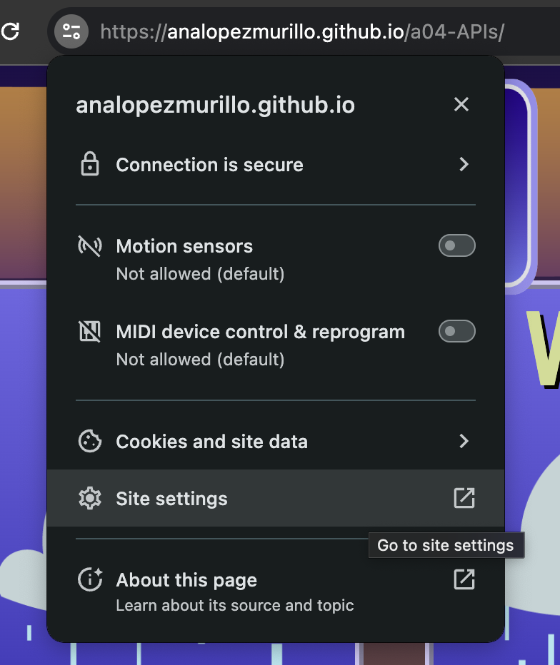
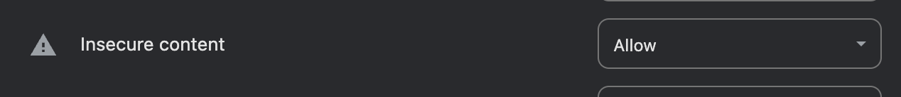

# A04-APIs
A04 Assignment - Public APIs

**⚠️ FLASH WARNING: ⚠️**

**This website features a VHS static effect, which includes flashing lights and screen shake.**

The website logs real-time as well as upcoming weather for the UNC Chapel-Hill area in a display inspired by The Weather Channel's design of the early 90s.  

Weather icons are made by logging WMO Weather intepretation codes and layered based on intensity.

All icons and graphics were hand-drawn using Adobe Illustrator.

## Run Instructions:
You can view the website at [this link](https://analopezmurillo.github.io/a04-APIs/). 

**PLEASE NOTE**: Since one of the APIs (7Timer!) is hosted on HTTP, Chrome will log this as an insecure website and not complete the request, thus not rendering some information. To fix this, please go to site settings as found below:

And change "Insecure Content" to Allow:

Reload the page and you will now be able to see the content loaded from 7Timer! (humidity and wind information). If you are not comfortable with this, please see below for instructions on how to run website locally. 

To run locally, clone the repository and run index.html with a live server. Please note that website may take a few seconds to build.

## APIs used:
[Open-Meteo](https://open-meteo.com/)
- Daily maximum temperature
- Daily minimum temperature
- Mean precipitation probability
- Current temperature
- Current precipitation probability
- WMO Weather Codes

[7Timer!](https://www.7timer.info/doc.php?lang=en)
- Wind speed
- Wind direction
- Relative Humidity
